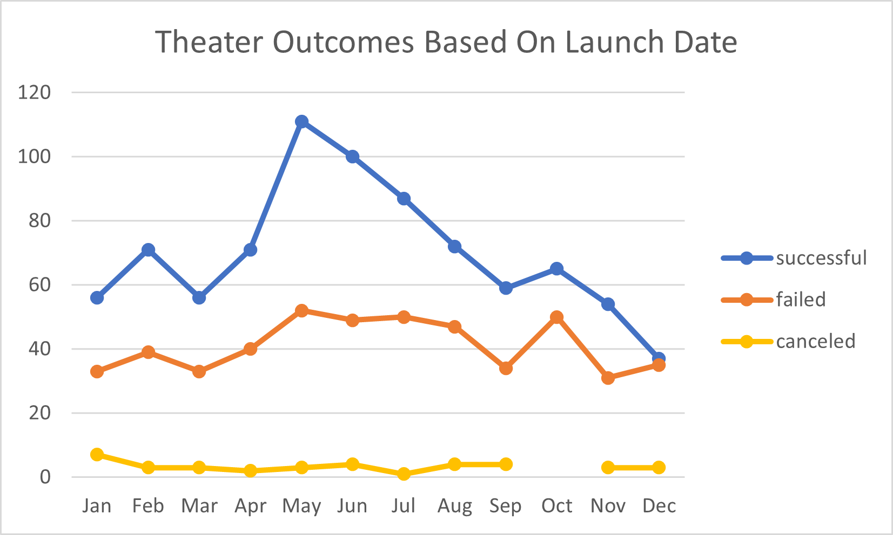
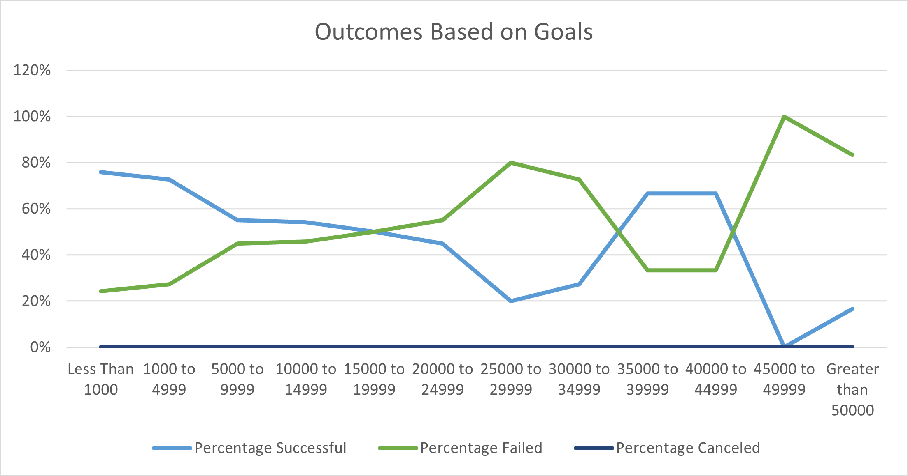

# **Kickstarter Campaign Funding Analysis - To Pay or Not to Play, That is the Questions?**

## **Overview of Project**

 - ### Project Purpose
   - The purpose of this project is to analyze Kickstarter campaign data for an emerging playwright Louise. The goal of this project is for Louise to gain a better understanding of different campaigns’ success rates in relation to their launch dates and their funding goals in order for Louise to make an informed decision on next steps. 
   - In this report, I will focus on how successful theater campaigns were based on their launch dates, and I will also compare how play campaigns fared based on their associated funding goals.

## **Analysis and Challenges**

 - ### Analysis of Theater Campaign Outcomes Based on Launch Date
   -  The line chart titled "Theater Outcomes Based on Launch Date" below illustrates how successful theater campaigns were based on their launch date.
   -  This chart was created by converting the Kickstarter campaign data into a pivot table and includes data from 2010 to 2017.  The `Year()` function was utilized to convert the Date Created Conversion column in the Kickstarter data to a year column.   
   -  On the x axis, the years are grouped by month.  This was accomplished by grouping the dates in the pivot table by month and represents the campaigns' launch months.
   -  The y axis shows the number of successful, failed, and canceled theater campaigns. 

   
    For further details on how analysis was performed, please see source spreadsheet. 
    [Kickstarter_Challenge](Kickstarter_Challenge.zip)

 - ### Analysis of Play Campaign Outcomes Based on Goals
   - The line chart titled "Outcomes Based on Goals" below illustrates how successful play projects were compared to different levels of funding goals.
   - This chart was created by converting the Kickstarter campaign data into a pivot table.  The `COUNTIFS()` function was used to populate the number of successful, failed, and canceled play projects.  The `SUMS()` function was used to come up with a total of the play projects based on the numbers returned by the `COUNTIFS()`.  A percentage was calculated based on the number of successful, failed, and canceled projects divided by the total projects per funding level.  
   -  The x axis shows the different funding goal levels utilized for the sake of this analysis.  
   -  The y axis shows the percentage of successful, failed, and canceled play projects based on the funding level goals.
   
   
   For further details on how analysis was performed, please see source spreadsheet. 
   [Kickstarter_Challenge](Kickstarter_Challenge.zip)

 - ### Challenges and Difficulties Encountered
   - Being unfamiliar with `COUNTIFS` statements presented a challenge during the course of this analysis.  Specifically, I struggled with how to input the higher end of the goal range.    
     - For example, when trying to calculate, the number of successful, failed, and canceled play projects, I initially input `=COUNTIFS(Kickstarter!$D:$D, ">=1000" AND "<=4999" ,Kickstarter!$F:$F, "successful",Kickstarter!$R:$R, "plays")` including `AND` to combine the lower and higher end of the funding goal range, but I received an error.   
     - Ultimately, I used the following formula and received the appropriate calculation `=COUNTIFS(Kickstarter!$D:$D, ">=1000",Kickstarter!$F:$F, "successful",Kickstarter!$R:$R, "plays", Kickstarter!$D:$D, "<=4999")`.
   - Also, if someone was attempting the Theater outcomes versus the launch date analysis and was unaware of the `YEAR()` function and the ability to group by months in the pivot table, that could create a roadblock when coming up with the with the final analysis results.

## **Results**

 - ### Outcomes Based on Launch Date - Theater Campaigns
   - It is recommended to launch theater campaigns in May and June because these months show to be the highest success rates.
     - In May, there were 111 successful campaigns out of 166 total campaigns (67%). 
     - In June, there were 100 successful campaigns out of 153 total campaigns (65%).  
   - 47% of theater campaigns launched in December failed, followed closely by 43% in October; it is not suggested to launch campaigns in these months.    
   - The cancellations are relatively low comparatively speaking, but the highest cancellation rate in a month falls in January (7%).
  
 - ### Outcomes Based on Goals - Play Projects
   - It appears that the lower funding goal categories produced a high success rate.   
   - Play campaigns with a goal of less than $1,000 were 76% successful.  Play campaigns with a goal between $1,000 and $4,999 were 73% successful.  Though it was out of scope for this project, I calculated the total funding raised between $0 and $4,999 which totaled approximately $1,170,000.
   - Play projects with funding goals between $35,000 and $44,999 were 67% successful which seems like a relatively high success rate comparatively speaking; however, there were only nine projects included in this goal funding level, and only approximately $270,000 were raised in this funding category.  
   - Note:  The percentages are only calculated within each funding level and not over the entirety of the play projects population.  For example, for the goal level of “less than $1,000,” there was a 76% success rate; however, the plays included in that statistic only fall within the less than $1,000 goal range population.  This range only makes up 18% (186 of the 1043) of the total play projects.
   - Given the current information, my recommendation would be for Louise to focus her efforts on smaller funding goals that fall between $0 and $4,999.   
   
 - ### Limitations in Dataset
   - Regarding play campaigns and their outcomes based on goal levels, there is significantly less data from the higher goal campaigns compared to the lower goal campaigns.
   - Approximately 85% of the campaign goal data falls under $10,000; while only 15% of the campaign goal data was above $10,000.
   - Perhaps the inclusion of more historical data in the higher level goal campaigns, could create a more robust sample for the higher funding levels, possibly providing a more complete picture of that goal level. 

 - ### Additional Suggested Tables or Graphs
   - As mentioned previously, in this project, we did not take into account the amount pledged or raised.  I believe this information would aid Louise in determining a direction.    
   - I would recommend adding a box and whisker plot, to compare the distribution of campaign goals and the distribution of total amounts pledged.  This would illustrate central tendency, spread, and identification of outliers to see if the data is skewed in any way.
